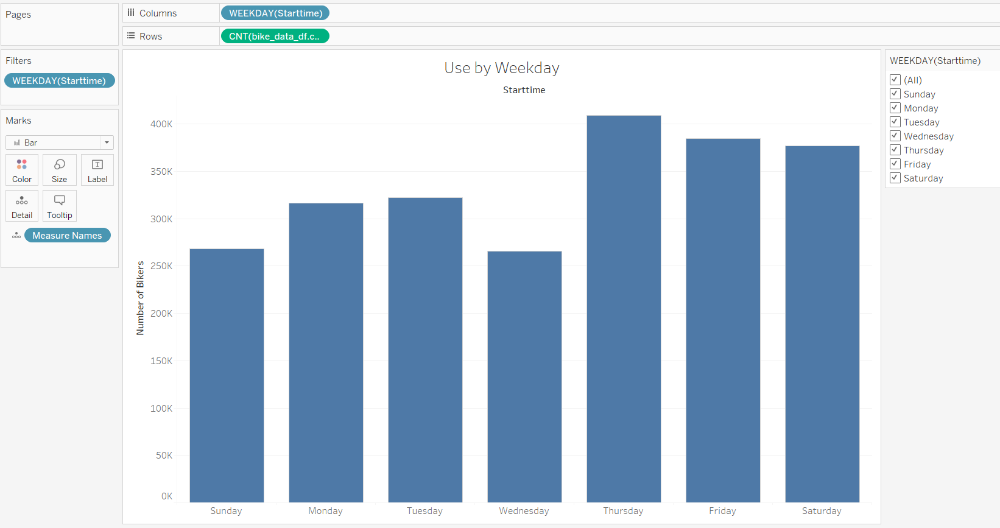
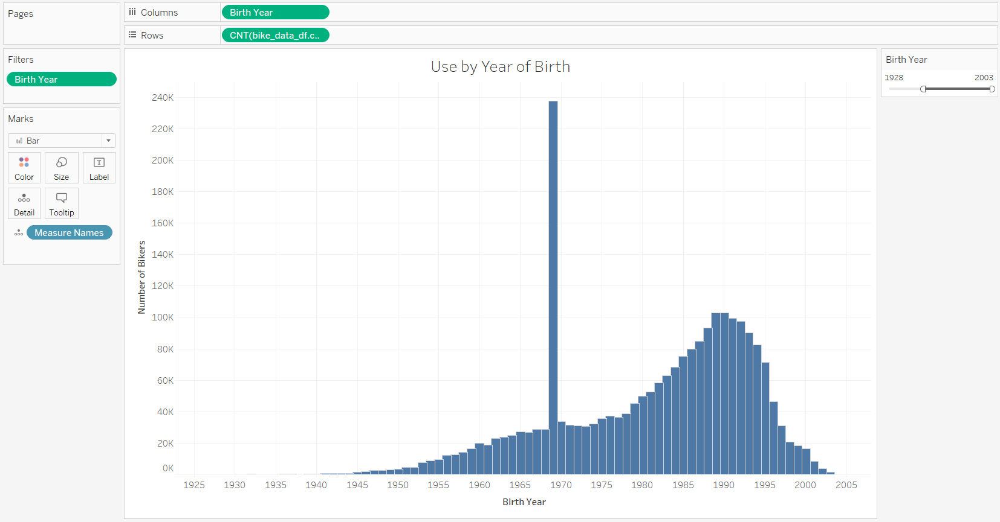
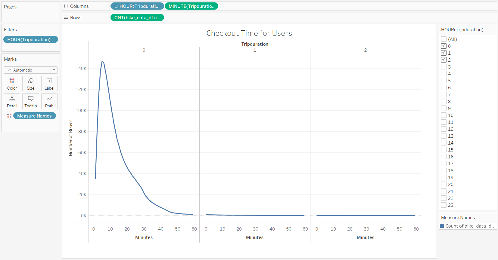
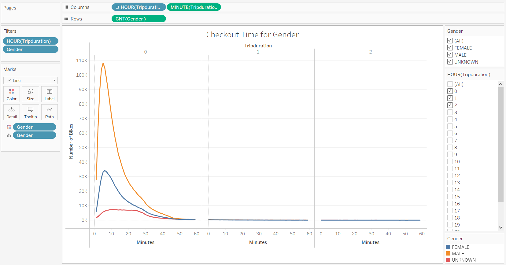
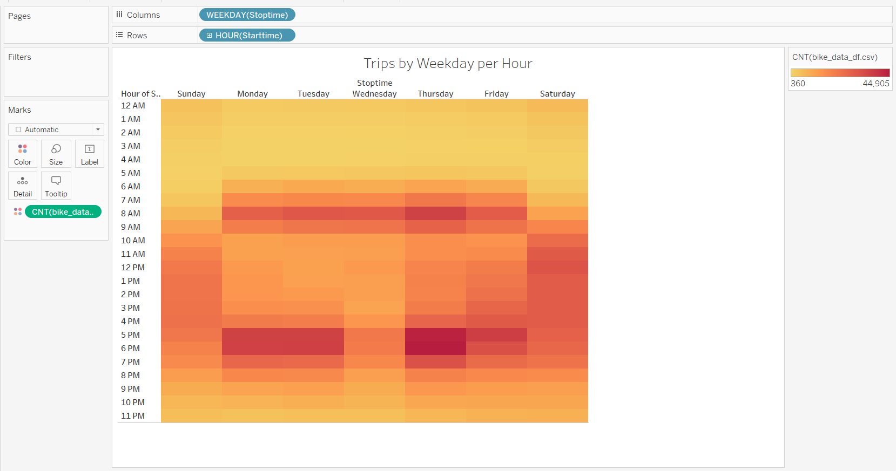
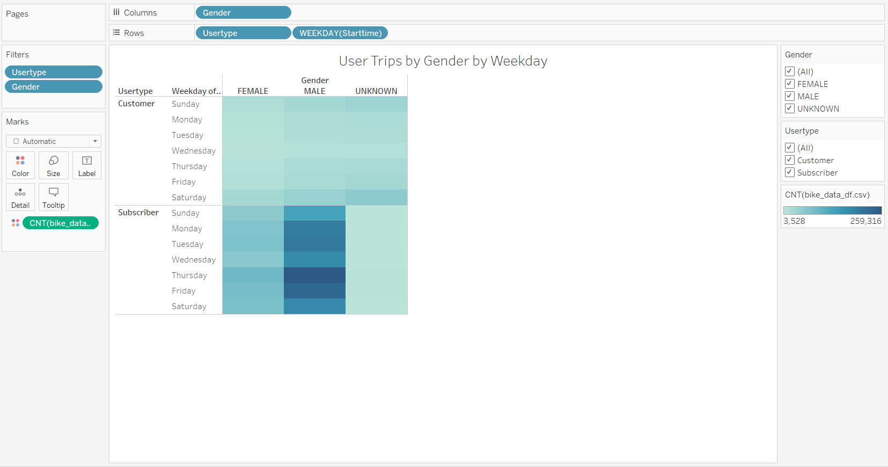

# Bikesharing with Python and Tableau: Analyzing Trip Duration Graphically in Tableau

## Overview of Project

## Link to Dashboard
[link to dashboard](https://public.tableau.com/authoring/bikesharing_16683026191490/UsebyWeekday)

### Purpose
The purpose of this analysis is to convince investors that a bikesharing program in Des Moines is a justified business proposal with an analysis of trips with a bikesharing program that should be comparable. The dataset is on New York City's Citi Bike bikesharing trips which includes trip duration, start time, stop time, start station ID, start station name, start station latitude, start station longitude, end station ID, end station name, end station latitude, end station longitude, bike ID, user type which is either subscriber or customer, birth year of the bike rideshare user, and gender of the bike rideshare user with digits 0, 1, and 2 to represent unknown, male, and female respectively. Graphical representations of the data includes a bar graph of number of bikers per weekday, a histogram of number of bikers by year of birth, a set of line graphs for the checkout time for users displaying trip duration for number of bikers overall, a set of line graphs for checkout times by gender displaying trip duration for number of bikers for each gender category, a heat map of trips by weekday per hour which compares weekday by hour of stop time, a set of heat maps of trips by gender by weekday per hour which compares weekday by hour of stop time for each gender type, and a set of heat map of trips by gender and user type by weekday per hour which compares weekday by hour of stop time for each gender type and the user type of consumer or subscriber. The data was originally uploaded September 18th, 2019.

## Results

### Project Analysis

The visualizations are displayed below as well as found via the link to the dashboard.

This first visualization is a bar graph for use of the bikesharing service in New York City with the number of bikers for each day of the week. Each day there are at least 250,000 bikers but the greatest number of bikers are at the Thursday though Saturday period at over 350,000 bikers for each of those three days. Overall, Wednesdays and Sundays see the least use.

This second visualization is a histogram for use of the bikesharing service in New York City with the number of bikers by year of birth. The oldest bikesharing user was born in 1932 while the youngest was born in 2003. The distribution is leftward skewed with increasing probability of use by younger people, most notably people who were born in the middle of millennial generation, with the peak at 1989-1990 which represents users who would be between the ages of 28 to 30 at that time. There is an anomaly of a large number of bikesharing use by those born in 1969 as well.

This third visualization is a set of line graphs for use of the bikesharing service in New York City with the number of bikers minutes of use for between 0-3 hours. There are three graphs showing if the number of minutes follows 0, 1, or 2 hours. The visualization shows a rightward skew with the largest number of observations concentrated at or around 5 minutes of use with declining levels of use past that plateauing around one hour of use.

This fourth visualization is a set of line graphs similar as it is for use of the bikesharing service in New York City with the number of bikers minutes of use for between 0-3 hours but with three different colored lines representing different genders of male, female, or unknown. There are three graphs showing if the number of minutes follows 0, 1, or 2 hours. the orange line is for males, the blue line is for females, and the red line is for unknown. The visualization shows a similar rightward skew with the largest number of observations concentrated at or around 5 minutes of use for all genders with declining levels of use past that plateauing around one hour of use. It is displayed that male users greatly exceed female users and the unknown gender category users in use of the bikesharing service.

This fifth visualization is a heatmap for use of the bikesharing service in New York City with the darker or lighter shading colors for weekdays and time of day depending on if there is more or less use respectively for that hour of that day. On the weekends, use has heavier concentration around midday. In contrast, during the weekdays, use is concentrated around early morning and early evening representing use to arriving at or departing work with especially heavy use early evening Thursdays.

.png)

This sixth visualization is a set of heatmaps similar as it is for use of the bikesharing service in New York City with the darker or lighter shading colors for weekdays and time of day depending on if there is more or less use respectively or that hour of that day but separated into different heatmaps by gender. There is not much data for the unknown category but for males and females there is a similar dynamic as on the weekends, use has heavier concentration around midday. In contrast, during the weekdays, use is concentrated around early morning and early evening representing use to arriving at or departing work with especially heavy use early evening Thursdays.

This seventh and final visualization is a set of heatmaps similar as it is for use of the bikesharing service in New York City with the darker or lighter shading colors for weekdays depending on if there is more or less use respectively but without the differentiation by hours and also separated for the type of use whether it is a subscriber of the service or a customer in addition to gender. Again, there is not much data for the unknown category although the slight shading for customer signifies the gender is unknown because they did not input it. For males and females, there is a clear tendency is for the users to be subscribers rather than mere customers, so we know the gender based on their subscription. Again, males tend to use the bikesharing service more than females. Again, it is noted that Wednesdays and Sundays see the least use.

## Summary

### Overview of Results

Overall, it appears that bikesharing services see support in urban areas and in particular to the demographic of millennial age males the most. Given the timing of when bikesharing services are used for which days of the week and which hours of the day see the most use then it is clearly noted that the users are using these services to bike to work during the morning and then to bike back after work while also using said services to bike to amenities on the weekend. Users especially use bikesharing services for shorter trips to save time travelling to places that they could likely walk to but would be far enough to take far more time to do so given personal preferences for time-saving but not too far to justify driving or taxi services. Users tend to be subscribers rather than mere customers so it is apparent most users see the recurring value in regularly using bikesharing services. If the Des Moines market has similar demographics then we can note that the bikesharing service would likely be relatively successful given the level of use in New York.

Additional visualizations that could be useful in the future include a mapping of the most popular bikesharing stations for starting and ending stations to determine the general characteristics of the neighborhoods of popular stations and routes; a heatmap overlay of said map with density of population to determine a possible calculation of an estimate of percentage of population who are users to then estimate the number of users in Des Moines; and possibly bar graphs of users by personal or socioeconomic categories, if possible, such as income level, occupation, or average level of physical activity per day to better understand users and if the Des Moines market is comparable for consumer characteristics. If information is not inputted already as per what was required by subscription then subscribers could be contacted if they would like to participate in a market survey. Also, it could be useful to visualize the market share of Citi Bike to other bikesharing organizations in New York City to determine also better understand the market for bikesharing services and how competition may affect a proposed service in Des Moines.
